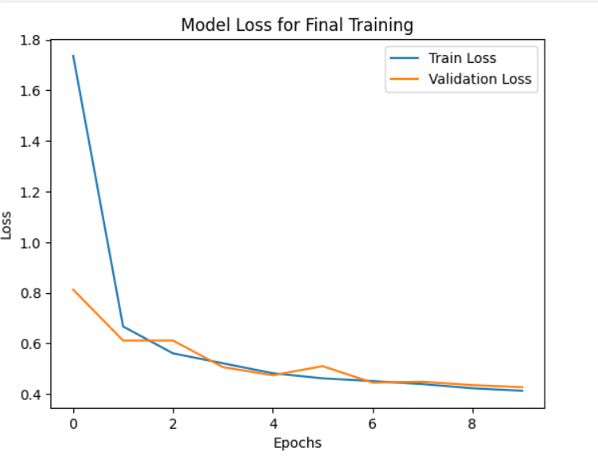
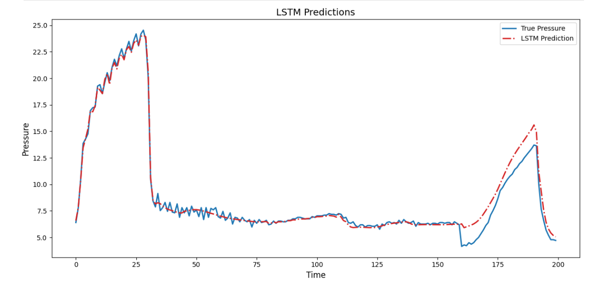

# **Ventilator Pressure Prediction: A Time-Series Approach to Biomedical Control**

## **1\. Project Overview & Objective**

"Ventilator Pressure Prediction" which challenges participants to predict airway pressure in an artificial lung circuit for COVID-19 patients. The core task is a high-frequency time-series regression problem where we must predict the continuous pressure value at each time step (0.003 seconds) for a given mechanical **breath cycle**.

**Objective:** The primary goal is to predict the internal airway pressure throughout a simulated 80-step respiratory cycle, minimizing the Mean Absolute Error (MAE) between the predicted and actual pressure readings.

Framing as Predictive Maintenance:  
Our methodology is inspired by predictive maintenance systems. We treat the ventilator circuit as equipment under continuous operation. Each breath\_id represents a unique operational sequence. By generating sophisticated time-series features (lags, rolling statistics, cumulative sums) and employing Recurrent Neural Networks (RNNs), we effectively monitor the dynamic state of the system (u\_in, u\_out, time\_step) to predict the critical system output (pressure). This approach is essential because the pressure dynamics are fundamentally dependent on the historical sequence of air delivery and flow.

## **2\. Data Description and Preparation**

Data source- Google Brain - Ventilator Pressure Prediction(https://www.kaggle.com/competitions/ventilator-pressure-prediction/overview)
The dataset is a complex time-series structured around individual respiratory cycles. Each breath is an independent sequence of 80 time steps.

| Feature | Description | Relevance to Prediction |
| :---- | :---- | :---- |
| breath\_id | Unique ID for each respiratory cycle (sequence). | **Key Grouping Variable** for all feature engineering operations. |
| time\_step | Time elapsed since the beginning of the breath (in seconds). | Captures the sequence order and instantaneous time delta. |
| u\_in | Inspiratory pressure/flow control input (continuous signal from the machine). | Primary input and determinant of airway pressure. |
| u\_out | Binary indicator (0 or 1\) of the expiration phase (exhale). | Defines the phase of the breath cycle. |
| R | Resistance value of the circuit (one of 5, 20, or 50 cmH2​O/L/s). | A static, but crucial, physical parameter. |
| C | Compliance value of the circuit (one of 10, 20, or 50 mL/cmH2​O). | A static, but crucial, physical parameter. |
| **pressure** | The target variable: measured airway pressure (cmH2​O). | **Target Variable.** |

## **3\. Methodology: Feature Engineering & Model Architecture**

High performance in this competition relies on capturing the sequential dependencies and the phase-dependent nature of ventilator physics.

### **A. Feature Engineering (Time-Series State Monitoring)**

To create a rich sequential representation, the following features were engineered based on physical principles:

1. **Cumulative Flow Dynamics:**  
   * u\_in\_cumsum: Total accumulated inspiratory flow up to the current time step. This directly models the volume of air delivered and is highly predictive of pressure build-up according to the pressure-volume relationship.  
   * u\_in\_cummean: Provides a smoothed, normalized measure of flow history.  
2. **Rate of Change (Lag/Delta Features):**  
   * Lagged values (u\_in\_lag1, u\_in\_lag2, u\_in\_lag3) and difference-of-lags (du\_in\_lag1, etc.) capture the *rate of change* (or acceleration) of the input flow, which is instantaneously related to pressure.  
3. **Phase and Time Indexing:**  
   * Binary phase features (phase\_inhale, phase\_exhale) clearly separate the very distinct physical regimes of the inspiration (u\_out=0) and expiration (u\_out=1) phases.  
   * step\_pos: Normalized step index provides the model with the relative position within the 80-step cycle, aiding generalization across different cycle durations.  
4. **Static/Statistical Context:**  
   * Per-breath\_id statistics (mean, max, min, std) for key dynamic features (u\_in, u\_in\_cumsum) were calculated and broadcast back to all time steps.

### **B. Data Preprocessing and Reshaping**

1. **Scaling:** The features were scaled using **Robust Scaling (RobustScaler)** to ensure all inputs are normalized and to minimize the impact of potential outliers, a common issue with sensor data.  
2. **Sequence Formatting:** The flat data structure was reshaped into a 3D tensor, X∈RN×80×F, where N is the number of breaths and F is the number of features (28), making it suitable for RNN ingestion.

### **C. Deep Learning Model (Bidirectional LSTM)**

The prediction task requires a model that can capture dependencies across the entire sequence. A **Recurrent Neural Network (RNN)** is inherently suited for this.

The chosen architecture is a stacked **Bidirectional LSTM (BiLSTM)** model:

1. **Input Layer:** Input(80,num\_features)  
2. **Bidirectional LSTM (64 Units):** The BiLSTM wrapper processes the sequence both forwards and backwards. This is crucial for problems like this, where the physics of the *full* 80-step cycle (including the exhalation phase) informs the pressure dynamics at any given time step.  
3. **Bidirectional LSTM (32 Units):** A second, smaller layer for hierarchical feature extraction.  
4. **Output Layer:** Dense(1,activation=’linear’). This produces the final continuous pressure prediction for each of the 80 time steps.

The model was optimized using the **Adam** optimizer and trained to minimize the target metric, **Mean Absolute Error (MAE)**.

## **4\. Results & Conclusion**

The trained Bidirectional LSTM model achieved a strong performance on the validation set after 10 epochs.

| Metric | Validation Score | Status |
| :---- | :---- | :---- |
| **Mean Absolute Error (MAE)** | **0.4275** | Target Metric (Lower is better) |

The prediction quality can be visualized by comparing the true pressure curve against the model's output:

Conclusion:  
The developed predictive framework successfully combines physics-informed, time-series feature engineering with the sequence modeling power of the BiLSTM architecture. The achieved MAE of 0.4275 confirms that the model robustly captures the essential, complex dynamics of the ventilator's operational state, providing accurate pressure predictions across the respiratory cycle.

## **5\. Next Steps and Optimization**

To further improve the solution and potentially reach a higher leaderboard score, the following avenues for optimization could be explored:

* **Hyperparameter Tuning:** Systematically tune hyperparameters (learning rate, batch size, LSTM unit counts, dropout) using tools like **Optuna** (imported but not used in the provided notebook).  
* **Model Complexity:** Test deeper architectures, larger LSTM units, or different RNN variants (e.g., GRUs, or using Attention mechanisms).  
* **Regularization:** Introduce **Dropout** layers or **L2 Regularization** to the LSTM layers to mitigate overfitting, especially if training for more epochs.  
* **Cross-Validation:** Implement GroupKFold (imported but not used) based on breath\_id to ensure the model's robustness and to generate out-of-fold predictions for better blending/stacking later.
